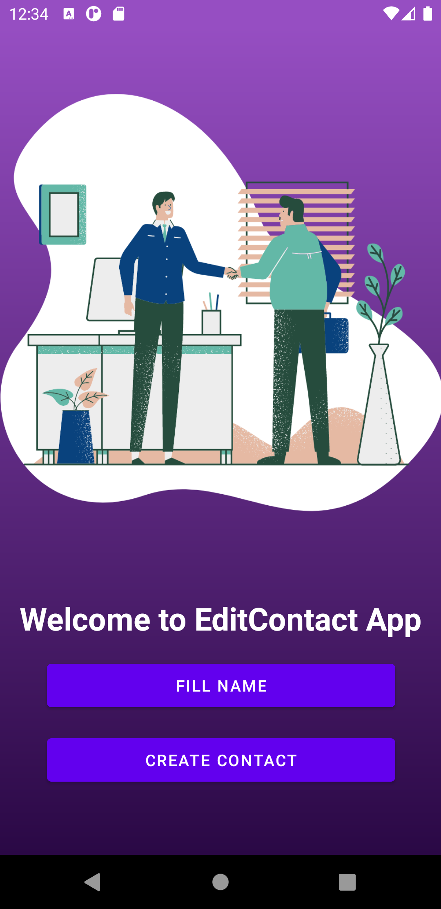
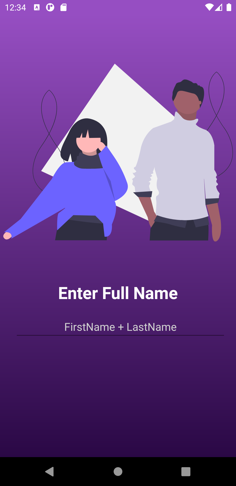
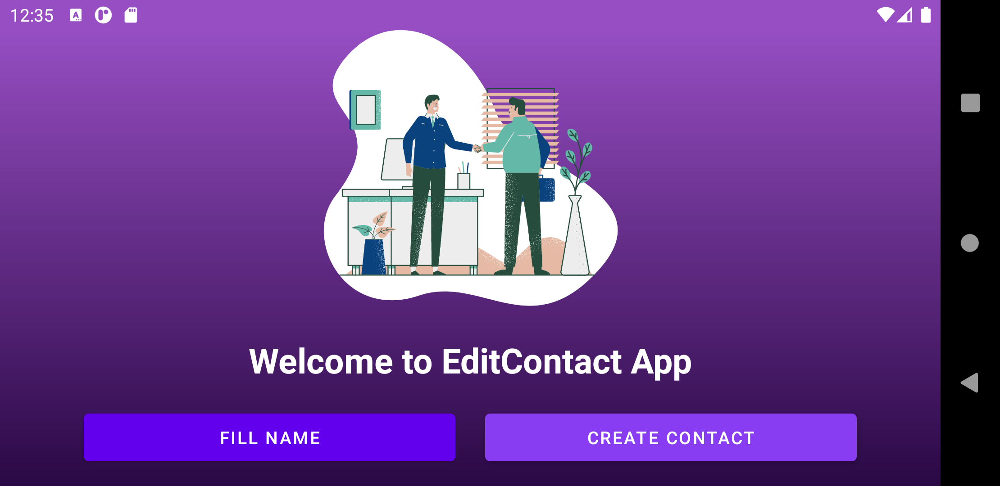
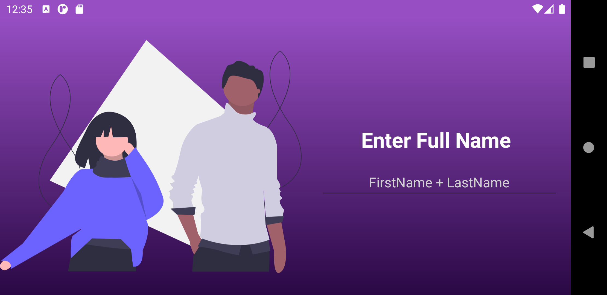
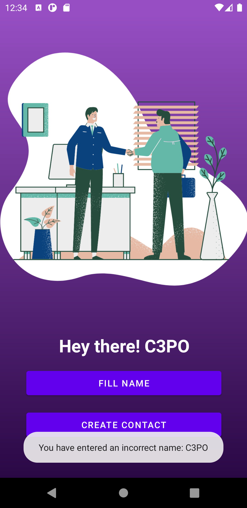

# EditContact App

## What is EditContact App?
This Android app is built as part of the course CS478 Software Development for Mobile Platforms. This is the first project in the series of 5 projects in this course.

Project Requirement can be found [here](./Project1_Requirements.pdf).

## Specification
- Android 11 - API Level 30
- Emulator: Pixel 3a XL
## How to build it?
1. Download or clone this repository using the command
```
git clone https://github.com/laxmena/CS478-AndroidApp-Project1.git
```
2. Launch _Android Studio_ and select _Open existing Android Studio Project_, then select __CS478-AndroidApp-Project1__ project in the file browser.
3. Build and run the application using emulator or physical device.

## App Screenshots

**Portrait View**
1. Home Screen

2. Activity2 - Fill Name


**Landscape View**
1. Home Screen

2. Activity2 - Fill Name


**Error Alert**
Full Name validation conditions: No numeric values, should contain a first and a last name.
1. Full Name Validator - Error message


## Additional Information
If you have any additional questions, feedbacks, suggestions or recommendations, feel free to contact me through [Email](mailto:WriteTo@laxmena.com) or [LinkedIn](https://www.linkedin.com/in/lakshmanan-meiyappan/).

Check out my blog/website here: [https://laxmena.com](http://laxmena.com/).